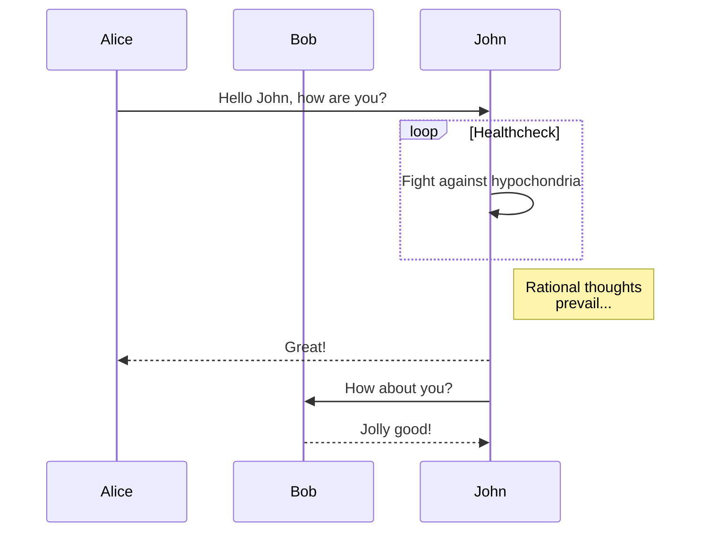

> 一个平凡但非常有意义的开始


## 前言

时隔一年，再度续费了自己的域名，希望给自己一段时间养成书写的习惯。

[Mingfer's Blog](www.mingfer.cn) 主要关注 Java ，密码算法，数字证书和分布式相关的技术。中间或许会乱入一些读书笔记和胡言乱语，会更新什么内容大概看天意吧，但是大体上这个 Blog 是走技术路线的。

这里非常感谢 [@黄玄 Hux](https://huangxuan.me/) 提供的优秀模板，它为 Blog 站点的搭建和美化提供强有力的支持。

这篇 Blog 的主要目的是测试一下 GitHub Page 对于一写 Markdown 特殊语法的支持，所以不感兴趣的同学可以略过正文了。

----

## 正文

### 表格
文本信息：
```markdown
| 序号 | 名称     | 说明                                                         |
| ---- | -------- | ------------------------------------------------------------ |
| 1    | markdown | Markdown 是 HTML 代码的简单形式，或者说它更是一种无干扰写作的手段，它比 Word 更简单，更简洁。 |
| 2    | mermaid  | memaid 使我们从 Visio 这类繁重的工具中解决出来，它允许我们使用 markdown 一样的语法来简单的绘制流程图，甘特图和时序图。 |
| 3    | Typora  | Typora 是一款非常优秀的用于编写 markdown 文本的软件。 |
```
效果图：


实测效果：

| 序号 | 名称     | 说明                                                         |
| ---- | -------- | ------------------------------------------------------------ |
| 1    | markdown | Markdown 是 HTML 代码的简单形式，或者说它更是一种无干扰写作的手段，它比 Word 更简单，更简洁。 |
| 2    | mermaid  | memaid 使我们从 Visio 这类繁重的工具中解决出来，它允许我们使用 markdown 一样的语法来简单的绘制流程图，甘特图和时序图。 |
| 3    | Typora   | Typora 是一款非常优秀的用于编写 markdown 文本的软件。        |

### 时序图

文本信息：

```markdown
sequenceDiagram
　　　participant Alice
　　　participant Bob
　　　Alice->>John:Hello John, how are you?
　　　loop Healthcheck
　　　　　John->>John:Fight against hypochondria
　　　end
　　　Note right of John:Rational thoughts <br/>prevail...
　　　John-->>Alice:Great!
　　　John->>Bob: How about you?
　　　Bob-->>John: Jolly good!
```

效果图：


实测效果：



### 引用信息

引用信息使用两个方括号 `[][]` 来标识，前一个括号是引用的内容，后一个括号是信息 ID。

```markdown
This is [an example][id] reference-style link.

Then, anywhere in the document, you define your link label on a line by itself like this:

[id]: http://example.com/  "Optional Title Here"
```

详细的介绍可以参考 [Typeora][1] 。

[1]: https://www.typora.io/	"Typora"

### 任务列表

任务列表使用 `[ ]` 标识未完成的任务，使用 `[x]` 标识完成的任务：

```markdown
- [ ] a task list item
- [ ] list syntax required
- [ ] normal **formatting**, @mentions, #1234 refs
- [ ] incomplete
- [x] completed
```

* [ ] 这个是一个任务列表

### 脚注

```markdown
You can create footnotes like this[^footnote].

[^footnote]: Here is the *text* of the **footnote**.
```

这里测试一个脚注[^1]

[^1]: 我的第一个脚注测试用例

### Emoji 

通过 `:smile:` 的格式引入一个 emoji，如 :smile:。

----

## 结语

关于 Markdown 高级语法支持的验证大概就这么多了，这里的重点是：[Typora](https://www/typora.io) 真的是一款书写 Markdown 文档的好帮手。

## 参考文献

